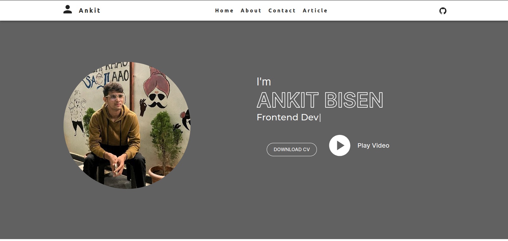

# Portfolio Website Readme

Welcome to my portfolio website! This website was built using React, leveraging the power of modern web development tools to create a seamless and engaging user experience. I've incorporated Sanity for managing articles, ensuring that the content on my website is not only visually appealing but also easily maintainable. The UI is designed with Material-UI (MUI), a popular React UI framework that provides a set of customizable components for building responsive and aesthetically pleasing user interfaces. 


## Technology Used

- React : A powerful JavaScript library for building user interfaces. The entire website is built on React components, providing a modular and efficient structure.

- Sanity : I have integrated Sanity as a headless CMS to manage articles on my portfolio. This allows for easy content updates and ensures a smooth content management workflow.

- Material-UI (MUI) : The UI components of the website are designed using MUI, which offers a set of pre-designed React components following the Material Design principles. This not only enhances the visual appeal but also improves the overall user experience.
## Features

- Responsive Design: The website is designed to be fully responsive, ensuring a consistent and enjoyable experience across various devices and screen sizes.

- Dynamic Content: Articles and other dynamic content are managed through Sanity, providing a flexible and scalable solution for updating and adding new content.

- Interactive UI: Leveraging the capabilities of React, the website features an interactive and dynamic user interface, making the user experience engaging and enjoyable.
## Website look like this




## Run Locally 

Clone the project

```bash
  git clone git@github.com:ankitbisen28/my-portfolio.git
```

Go client Folder 
```   
  cd client
```

Install Frontend dependencies

```bash
  npm install
```

Start the Frontend Development Server

```bash
  npm start
```

## Open another Terminal 
Open another Terminal For Backend 
stay at root directory

Go portfolio Folder 
```   
  cd portfolio
```

Install Sanity dependencies

```bash
  npm install
```

Start the Sanity Development Server

```bash
  npm start
```
## 🚀 About Me
Hello Everyone, 
 Hi, I'm Ankit Bisen, a 20-year-old Software Development Student with a bachelor of Vocational in Software development and experience with MERN Stack Development. 


## 🔗 Links
[](https://ankitbisen.live/)
[](https://www.linkedin.com/in/ankitbisen28)
[](https://twitter.com/ankitbisen28)


## 🛠 Skills
Javascript, HTML, CSS..., React, Nodejs, MUI, Express js. 


## Acknowledgments

Special thanks to the open-source communities behind React, Sanity, and Material-UI for providing powerful tools and frameworks that made the development of this portfolio website a smooth and enjoyable experience.

I hope you enjoy exploring my portfolio as much as I enjoyed building it!

Happy coding